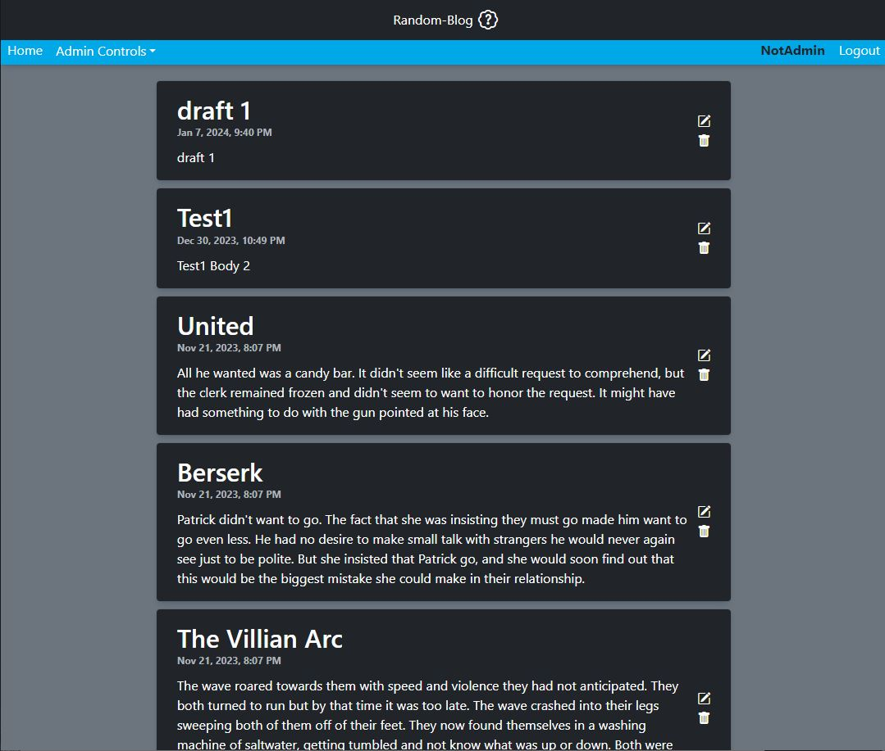

# TheOdinProject - Project: Blog API

This is a solution to the [Project: Blog API](https://www.theodinproject.com/lessons/nodejs-blog-api). 

## Table of contents

- [Overview](#overview)
  - [The challenge](#the-challenge)
  - [Screenshot](#screenshot)
  - [Links](#links)
- [My process](#my-process)
  - [Built with](#built-with)
  - [What I learned](#what-i-learned)
  - [Continued development](#continued-development)
  - [Useful resources](#useful-resources)
- [Author](#author)


## Overview

### The challenge

Users should be able to:

- User have access and edit blog post
- Build a single author using a user model
- Blog should contain post and comments
- Post should have a published or unpublished post


### Screenshot





### Links

LOGIN INFOS:

NotAdmin - Odin4321.

Raiku - Odin1234.

Exia - Odin1234.

Soobaru - Odin1234.

- Solution URL: [https://github.com/kevo760/randomblog-TheOdinProject]
- Live Site URL: [https://rando-blog.onrender.com/]

## My process

### Built with

- Semantic HTML5 markup
- CSS custom properties
- Flexbox
- CSS Grid
- Bootstrap
- React
- ExpressJS
- Styled Components


### What I learned

I wanted to take my learning to the next level by using the MERN Stack even though the project only called for an ExpressJS only project. It was
a lot of brainstorming and watching youtube tutorials figuring out how to tie Express and React together. I learned that you use fetch to send the data to
the backend server, get the response and convert the data. I also learned that on the backend you pass the data as a json, instead of loading a page via EJS when using
React. Middleware was another thing that I thought hard on due to the fact that I did not know how you would send the data back to the user in the frontend, but
watching NetNinja on their MERN stack tutorial it all made sense. I was able to learn I could pass the user data by using req.user and if the user is not authorized
I can pass and res.status(400). 


```js
useEffect(() => {
        const fetchPost = async () => {
            const res = await fetch('/post');
            const json = await res.json();

            if(!res.ok) {
                setError(true)
            }

            if(res.ok) {
                setError(false)
                dispatch({ type: 'SET_POSTS', payload: json })
            }  
        }

        fetchPost();
    }, [dispatch])

exports.get_all_post = asyncHandler(async (req, res, next) => {
    const allPosts = await Post.find({}).sort({createdAt: -1});

    res.status(200).json(allPosts);
});

const requireAuth = async(req, res, next) => {

    // Verify authentication
    const { authorization } = req.headers;

    if(!authorization) {
        return res.status(401).json({error: 'Authorization required'})
    }
    // Splits Bearer and token
    const token = authorization.split(' ')[1]

    try {
       const { _id } = jwt.verify(token, process.env.JWT_SECRET)

        req.user = await User.findOne({_id}).select('_id')
        next()

    } catch(error) {

        res.status(401).json({error: error.message})
    }
}

```


### Continued development

I would like to learn more on the advance techniques on bringing react and expressjs. One thing that I had a hard time was using the reducer methods, specifically
being able to change the state without mutating it on arrays and objects inside arrays better. 


### Useful resources

- [Stackoverflow](https://www.stackoverflow.com) - This helped me searched for certain functions that I had forgotten and needed more information on. 
- [Net Ninja - Youtube](https://www.youtube.com/watch?v=98BzS5Oz5E4&list=PL4cUxeGkcC9iJ_KkrkBZWZRHVwnzLIoUE) - Thank you Net Ninja! This allowed me to understand how the MERN stack worked all together. 


## Author

- Email - [kevin760g@gmail.com]


